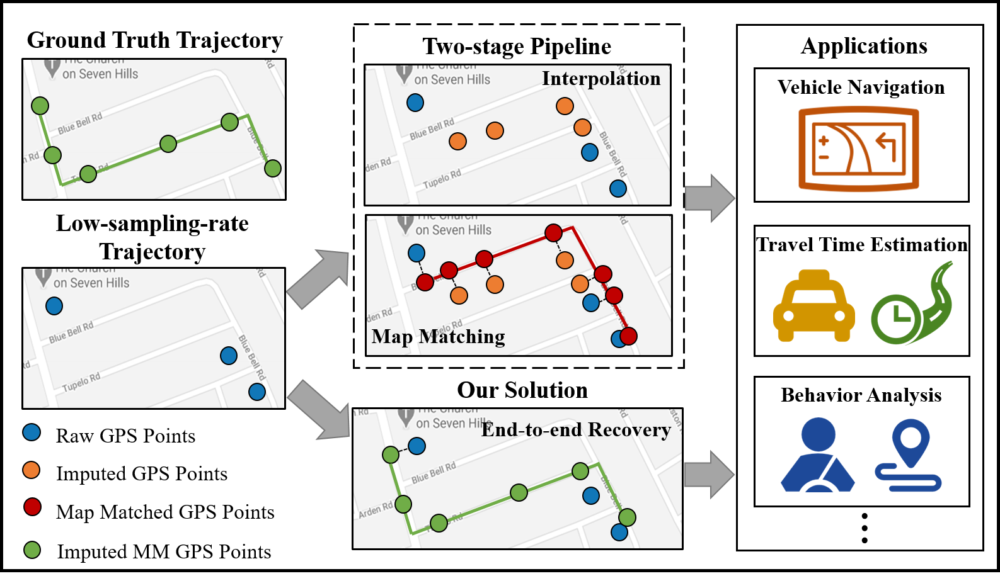
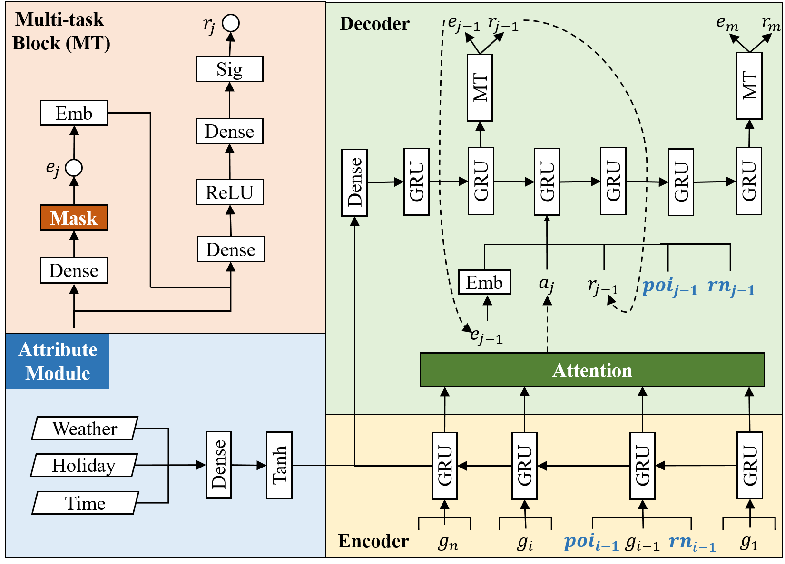

# MTrajRec
<p align="center">


</p>

## About
Source code of the KDD'21: [MTrajRec: Map-Constrained Trajectory Recovery via Seq2Seq Multi-task Learning](doc/KDD21_MTrajRec_Huimin.pdf)
## Requirements
* Python==3.6
* `pytorch==1.7.1`
* `rtree==0.9.4`
* `GDAL==2.3.3`
* `networkx==2.3`

## Usage
### Installation
#### Clone this repo:
```bash
git clone git@github.com:huiminren/MTrajRec.git
cd MTrajRec
```
#### Running
  `python multi_main.py`

#### Dataset
We provide sample data under data/.

Please note that the sample data is generated with the structure as the original data. For the data preprocessing, please refer to [tptk](https://github.com/sjruan/tptk).

## Acknowledge
Thanks to [Sijie](https://github.com/sjruan/) to support data preprocessing.

## Citation
If you find this repo useful and would like to cite it, citing our paper as the following will be really appropriate: <br>
```
@inproceedings{ren2021mtrajrec,
  title={MTrajRec: Map-Constrained Trajectory Recovery via Seq2Seq Multi-task Learning},
  author={Ren, Huimin and Ruan, Sijie and Li, Yanhua and Bao, Jie and Meng, Chuishi and Li, Ruiyuan and Zheng, Yu},
  booktitle={Proceedings of the 27th ACM SIGKDD Conference on Knowledge Discovery \& Data Mining},
  pages={1410--1419},
  year={2021}
}
```


